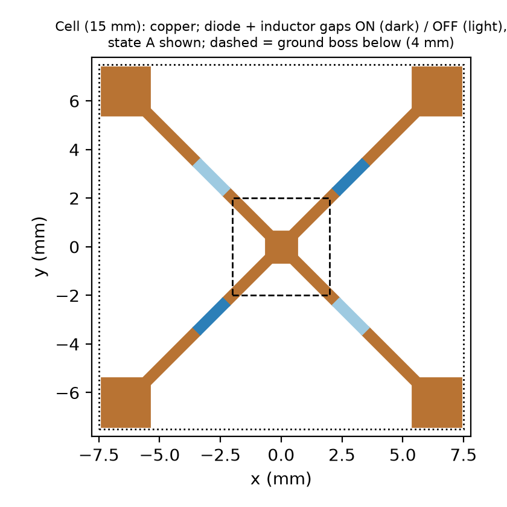
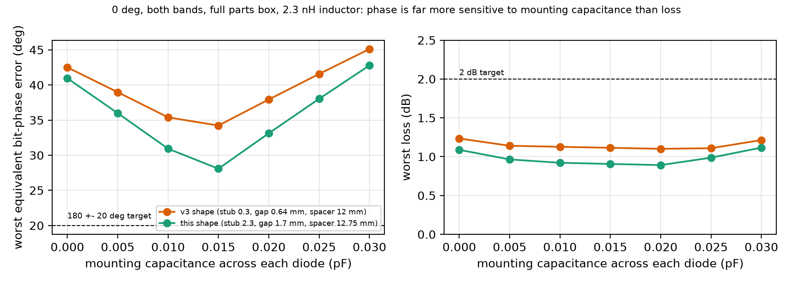
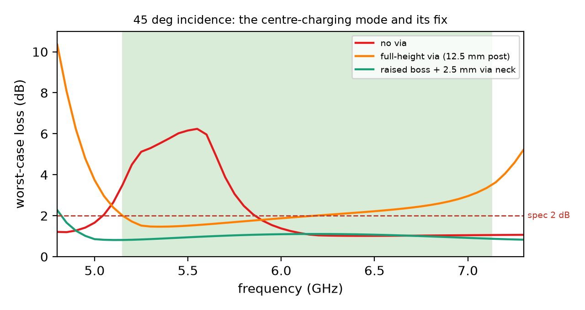
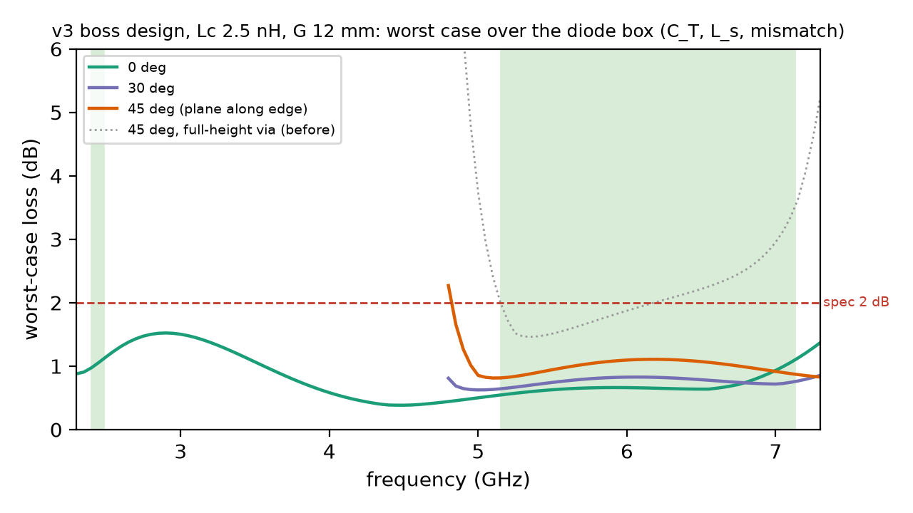
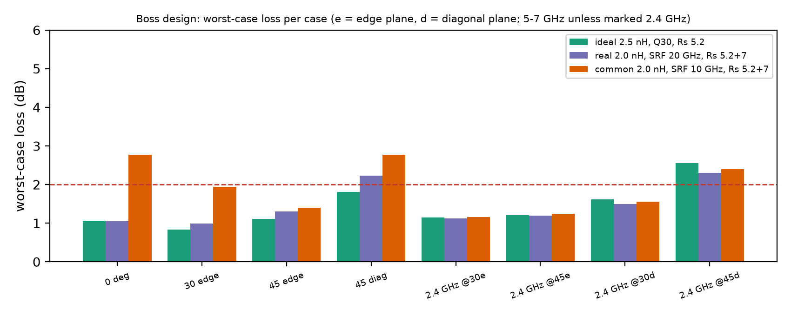
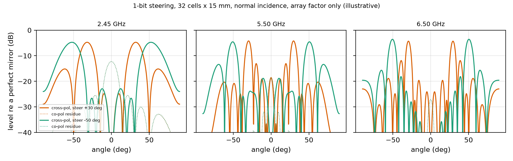

# One switch, three Wi-Fi bands: a 1-bit polarisation-rotating RIS cell (simulation study)

**Status: simulation only (Palace 0.18.1 full-wave FEM + exact network algebra). Nothing has been built or measured.** Release 1.0.0.

## In plain words

A reconfigurable intelligent surface (RIS) is a "smart mirror" for radio: a flat panel of small cells that can each flip the wave they
reflect, so the whole panel can steer Wi-Fi into a dead zone without a radio or amplifier of its own.

This study started from the tri-band phase-stability problem named in the PARISO paper (Sekharan et al. 2026): a RIS cell's switched phase
drifts between the 2.4 GHz, 5 GHz and 6 GHz Wi-Fi bands, so a code that works in one band fails in another. It designs **one 15 mm cell whose
single 1-bit switch state covers 2.4-2.4835 GHz and the full 5.15-7.125 GHz span of Wi-Fi 5/6E/7**, within 2 dB of loss at every
simulated angle except 45 deg along the cell diagonal, and with the bit phase only partly meeting the usual target (details below). We did not find a published cell
that covers both with one shared bit (closest work below).

- **One shared switch state, both bands, realistic parts.** Worst-case loss (defined below; it includes the unsteered leak) over the full parts box (diode spread, inductor tolerance,
  0.013-0.017 pF mounting capacitance; all cells in the same state, opposite neighbours in the supercell section): **0.81-0.91 dB straight on**, at most 1.24 dB tilted to 45 deg along the cell edges and to 30 deg
  along the cell diagonal (1.37 dB at 2.4 GHz). **One corner misses: 45 deg along the cell diagonal (2.21 dB at 2.4 GHz, 2.28 dB at 5-7 GHz)**,
  a geometric limit of a single copper layer (explained below).
- **The bit: exact where symmetry holds, a measured leak elsewhere.** The two switch states are mirror images, so for a wave polarised along
  a cell edge the steerable (rotated) part of the reflection flips by 180 deg within 1.33 deg over every parts corner and tilt along the edges.
  What symmetry does not fix is a small unrotated leak that goes into a mirror-direction lobe; counted as the phase error of an ordinary bit
  (the "equivalent bit-phase error", defined below) it is 19-23 deg straight on with typical parts (meets 180 +- 20 deg in the 5-7 GHz band),
  27-30 deg at the worst parts corners, and more with tilt. **A strict 180 +- 20 deg target is therefore met only straight on with typical
  parts in the 5-7 GHz band.** The leak changes the steered beam by at most 0.12 dB in our array-factor check (0 deg, typical parts, four frequencies); it costs power, which the loss numbers already include.
- **What changed in this release:** the copper was reshaped (the diode moved 2 mm outward along each arm, its gap widened from 0.644 to 1.7 mm)
  and tuned with realistic mounting capacitance included. Re-simulated at every angle, it beats the earlier shape in every case under the same model and mesh, by 0.2-0.3 dB
  in loss and 3-8 deg in phase, and the wider gap now has physical room for the diode and the inductor in series.
- **Three ideas make it work:** (1) a polarisation-rotating, mirror-symmetric layout; (2) a small chip inductor in series with each diode,
  which opens the third band; (3) a small raised metal block (boss) under the cell centre with a short via, which suppresses a tilt-only
  "centre-charging" resonance.
- **Design rules that fell out:** the series inductor needs a high self-resonance (parts at 16.5-20 GHz pass, a 10 GHz part fails; the threshold in between was not swept
  finely) (a common 0201 part at its minimum
  specified 10 GHz, e.g. the Murata LQP03TN series, roughly doubles its inductance near 7 GHz and breaks the 5-7 GHz band; our inference),
  and the land pattern must be designed in, because the bit phase is far more sensitive to mounting capacitance than the loss is.
- **A lower-capacitance diode (MACOM MA4AGFCP910) is an option** with two tunings: 1.9 nH gives the best phase (17.6-17.8 deg straight on,
  typical parts), 2.5 nH meets 2 dB loss at every simulated angle in 5-7 GHz including the 45 deg diagonal (1.77 dB) but misses that
  corner at 2.4 GHz (2.32 dB). No single inductor value fixes the diagonal in both bands.

*Fig. 1: the cell (one copper layer; four PIN diodes, each in series with a chip inductor, across the gaps in the diagonal arms).*

## Design

| item | value |
|---|---|
| period | 15 mm |
| stack | ground plane with a raised 4 x 4 mm metal boss under the centre / 12.75 mm air spacer / RO4003C 0.508 mm / one copper layer |
| copper | 1.275 mm square centre pad; four diagonal arms 0.4 mm wide: a 2.3 mm stub from the pad, the 1.7 mm diode gap, then the arm to a 2 mm square corner pad 0.1 mm from the cell edge (0.2 mm gaps couple neighbouring cells) |
| switches | 4 x PIN diode MACOM MADP-000907-14020 (C_T 0.025 pF typ / 0.030 pF max at -10 V, 1 MHz; R_s 5.2 ohm typ / 7.0 ohm max at 10 mA, 1 GHz). State A: NE + SW on, NW + SE off. State B: the mirror image |
| series inductor | 2.3 nH 0201 chip inductor with a high self-resonance (16.5-20 GHz verified) in series with each diode (e.g. Coilcraft 0201DS-2N3, SRF typ 16.5 GHz). Common 10 GHz-SRF parts break the 5-7 GHz band |
| mounting | designed for 0.015 pF of land-pad and solder capacitance across each diode (scored over 0.013-0.017 pF). The 1.7 mm gap is about the length of the flip-chip diode (0.77 mm) plus the 0201 inductor (0.58 mm) with a short island between them; their outer pads overlap the stub and the arm, and the inductor (0.46 mm wide) is wider than the 0.40 mm arm. The land pattern itself was not designed or simulated here |
| angle fix | the boss rises to 2.5 mm below the board and is joined to the centre pad by a short via (also usable as the DC return) |
| diode bias | OFF state at -10 V (the datasheet specifies C_T only at -10 V); ON at ~10 mA (R_s specified at 10 mA) |
| bias (concept) | corner bias posts with a stacked 33 nH + 10 nH chip choke (preliminary, earlier shape, see below) |

## What the numbers mean

For an incident plane wave of polarisation e, the two states reflect R_A e and R_B e (2 x 2 TE/TM reflection matrices). Mirror symmetry
splits them into R_A = R_fix + R_sw and R_B = R_fix - R_sw: only the switched part R_sw flips with the code and can be steered.

- **Loss = -20 log10 |R_sw e|** (both output polarisations counted): everything that does not end up in the steerable beam, i.e. power
  absorbed in the diodes, inductors and board plus the power left in the fixed specular part R_fix.
- **Equivalent bit-phase error = 2 atan(|R_fix e| / |R_sw e|)**: the phase error of an ordinary equal-amplitude 1-bit cell that leaves the
  same unswitched (specular) reflection. It also counts amplitude imbalance, so it is stricter than a phase-only figure. The usual RIS target
  is a 180 +- 20 deg bit, i.e. an equivalent error of 20 deg or less.
- **Worst case** = maximum over the parts box: diode R_s 5.2 and 7.0 ohm, C_T 0.022 / 0.025 / 0.030 pF, package L_s 0.2-0.4 nH (an assumed
  range, not a datasheet limit), +-5 % C_T mismatch between the two OFF diodes, inductor +-0.1 nH, and mounting capacitance 0.013-0.017 pF.
  **Typical** = R_s 5.2 ohm, C_T 0.025 pF, L_s 0.3 nH, 0.015 pF, no mismatch.
- **Diode model.** ON: R_s + jw L_s. OFF: an assumed 60 ohm series loss (not a datasheet value) in series with C_T, plus the same L_s. MACOM's measured on-wafer S-parameters for this
  diode family give 0.026-0.028 pF OFF (-5 V) and 3.15 ohm ON (10 mA) over 2-8 GHz (series branch of the ABCD matrix, so the fixture's pad
  capacitance is excluded; `scripts/macom_extract.py` prints these from the vendor files, which are not redistributed): inside the box, and
  the R_s corners are conservative.
- Headline numbers assume all cells in the same state (infinite periodic sheet); opposite neighbours are checked separately (supercell section).

## Results with realistic parts (reproduce with `python reproduce.py`)

Series inductor: generic 0201 model, 2.3 nH, self-resonance 20 GHz, Q(f) = 14 sqrt(f / 0.5 GHz) <= 40 (about 40 % of the 0201DS datasheet
Q, so pessimistic on loss). Every number in the tables below is printed by `reproduce.py` from the network files in `data/`.

| incidence | loss 2.4-2.4835 GHz | loss 5.15-7.125 GHz | equivalent bit-phase error, 2.4 / 5-7 GHz | frequencies (2.4 / 5-7) | incidence pol. |
|---|---|---|---|---|---|
| 0 deg | 0.91 dB | 0.81 dB | 27.2 / 30.1 deg | 101 sweep (2 inside the band) / 101 | TE |
| 30 deg, plane along a cell edge | 0.98 dB | 0.96 dB | 32.7 / 35.1 deg | 2 / 51 | TE |
| 45 deg, plane along a cell edge | 1.04 dB | 1.24 dB | 35.4 / 45.5 deg | 2 / 51 | TE |
| 30 deg, plane along a cell diagonal | 1.37 dB | 1.24 dB | 46.5 / 45.7 deg | 31 / 51 | TE and TM |
| 45 deg, plane along a cell diagonal | **2.21 dB (misses)** | **2.28 dB (misses)** | 67.7 / 70.3 deg | 2 / 51 | TE and TM |

**The same rules applied to the earlier (v3) copper shape**, for comparison (stub 0.3 mm, gap 0.644 mm, spacer 12 mm; same 2.3 nH inductor,
same parts box, same 0.013-0.017 pF mounting capacitance):

| incidence | loss 2.4-2.4835 GHz | loss 5.15-7.125 GHz | equivalent bit-phase error, 2.4 / 5-7 GHz | frequencies (2.4 / 5-7) | incidence pol. |
|---|---|---|---|---|---|
| 0 deg | 1.12 dB | 1.01 dB | 30.7 / 35.7 deg | 101 sweep (2 inside the band) / 101 | TE |
| 30 deg, plane along a cell edge | 1.19 dB | 1.19 dB | 36.4 / 43.1 deg | 2 / 51 | TE |
| 45 deg, plane along a cell edge | 1.27 dB | 1.51 dB | 39.1 / 52.9 deg | 2 / 51 | TE |
| 30 deg, plane along a cell diagonal | 1.60 dB | 1.46 dB | 49.8 / 52.2 deg | 31 / 51 | TE and TM |
| 45 deg, plane along a cell diagonal | **2.47 dB (misses)** | **2.51 dB (misses)** | 70.7 / 75.3 deg | 2 / 51 | TE and TM |

**Lower-capacitance diode option** (MACOM MA4AGFCP910, C_T box 0.016 / 0.018 / 0.021 pF, R_s 5.2 / 6.0 ohm; same shape, same rules):

| incidence | option A (1.9 nH): loss 2.4 / 5-7 GHz | option A: eq. phase | option B (2.5 nH): loss 2.4 / 5-7 GHz | option B: eq. phase |
|---|---|---|---|---|
| 0 deg | 0.75 / 0.65 dB | 21.8 / 26.5 deg | 0.91 / 0.94 dB | 31.0 / 38.5 deg |
| 30 deg edge | 0.81 / 0.73 dB | 27.7 / 30.5 deg | 0.99 / 0.68 dB | 36.1 / 23.6 deg |
| 45 deg edge | 0.88 / 1.08 dB | 31.0 / 41.8 deg | 1.05 / 0.87 dB | 38.4 / 36.2 deg |
| 30 deg diagonal | 1.15 / 1.02 dB | 41.1 / 39.3 deg | 1.42 / 1.19 dB | 50.3 / 45.9 deg |
| 45 deg diagonal | 1.92 / **5.25** dB | 62.5 / 77.6 deg | **2.32** / 1.77 dB | 71.3 / 59.9 deg |

Straight on with typical parts: option A 17.6 / 17.8 deg, option B 26.9 / 29.4 deg (this design: 22.6 / 19.3 deg; v3 shape 25.3 / 26.1 deg).
Option A's 5-7 GHz failure at 45 deg on the diagonal is one resonance at the lower band edge (5.15 GHz); with option B (2.5 nH) the 5-7 GHz band stays within 1.77 dB at that angle.

**With the measured inductor** (Coilcraft 0201DS-2N3 S-parameters, 2.3 nH, same box; `scripts/vendor_chip.py` after building the vendor table)
the 5-7 GHz worst-case loss is 0.74 dB straight on, 0.89 / 1.17 dB at 30 / 45 deg along the edge, 1.17 dB at 30 deg and 2.21 dB at 45 deg along the diagonal:
slightly better than the generic model used in the tables.

**Notes on the tables.** Edge-plane rows use TE incidence: mirroring the cell across an edge-aligned plane of incidence swaps the two
states, and reciprocity with the cell's 180 deg rotation symmetry makes the switched TE-to-TM and TM-to-TE terms equal, so TM incidence has
the same loss for matched diode pairs (confirmed numerically on an earlier no-boss cell); the leak, and so the phase column, can differ for
TM and was not computed. Diagonal-plane rows use both polarisations. The oblique 2.4 GHz cases are scored at the two band edges (2.4 and
2.4835 GHz) except the dense 31-point sweep at 30 deg on the diagonal. The 0 deg sweep has 101 points over 2.3-7.3 GHz, two of them inside
the narrow 2.4 GHz band. Straight on, the steerable loss is the same for any incident polarisation.

## Bit phase: what limits it, and what we tried

**Mounting capacitance is part of the tuning.** The OFF diode is a ~0.025 pF capacitor, and 0.015 pF of land-pad and solder capacitance
across it is 60 % more. Loss hardly notices (fig. 6, right), but the bit phase traces a V around the capacitance the cell was tuned for
(fig. 6, left): +-0.005 pF away from the design value costs 3-5 deg. A design must be tuned with its land pattern included; a land-pattern
simulation (not done here) is the next realism step.

*Fig. 6: straight on, both bands, full parts box, 2.3 nH: worst equivalent bit-phase error and loss vs mounting capacitance, v3 shape vs this shape.*

**What we tried.** (1) Extra parts at the diode (DC-compatible 0201 L/C networks, an optimiser over thousands of variants): no improvement.
The reason is general: straight on, the series reactance that would make the two states exactly antiphase *falls* with frequency, from ~116 ohm
near 5.7 GHz to ~82 ohm near 7 GHz, and no passive network can do that (Foster's reactance theorem), although an ideal per-frequency
reactance would reach 5.6-8.5 deg in 5-7 GHz (v3 shape, no mounting capacitance; `extra_checks.py` 4c). The copper, not the parts, has the headroom. (2) Copper shape: moving the diode 2 mm
outward along the arm and widening its gap from 0.644 to 1.7 mm gained 3-8 deg (and makes room for the two parts). Without mounting
capacitance such shapes reach ~18 deg (normal-incidence shape runs, `shape_exact.py`); with realistic mounting the best single-copper-layer
variants we found sit near 27-30 deg worst case.
(3) A deliberate larger capacitance across the diode helps 2.4 GHz but breaks 5-7 GHz. (4) At 45 deg along the diagonal even loss-free
switches (open / pure inductance, best inductance) leave 93 deg in this shape (`extra_checks.py` 4d): there the sheet looks ~41 % stronger
to one polarisation and ~29 % weaker to the other, so one antiphase condition
cannot hold for both. Shape scoring: `scripts/shape_exact.py` (exact 6-port network, analytic spacer transfer, per-diode mismatch).

**A lower-capacitance diode.** MACOM MA4AGFCP910 (AlGaAs flip-chip, C_T 0.018 pF typ / 0.021 max at -5 V and 10 GHz, R_s 5.2 ohm typ /
6.0 ohm max; MACOM's measured S-parameters: 0.016-0.018 pF OFF over 2-8 GHz) on this shape with a 1.9 nH inductor: see the option table in the results section (phase-tuned at 1.9 nH, loss-tuned at 2.5 nH).

**What the leak does on a panel.** R_fix is the same in every cell whatever the code, so a panel sends it only into the specular (mirror)
direction; the steered beam changes by at most 0.12 dB with or without it (array-factor check, `extra_checks.py` 4e). At an equivalent error of
20 deg the specular lobe sits ~11 dB below the steered beam; at 28-30 deg, ~7.5-8 dB. R_fix is half the trace of the cell's reflection matrix, so rotating cells
does not cancel it; fixed random delays or lambda/8 tile steps suppress it, but only over a narrow band.

**Where to mount it.** The weak case (plane of incidence along a cell diagonal near 45 deg) needs the along-wall and vertical offsets of the
source to be about equal. For a wall panel with its cell edges horizontal and vertical, same-height paths lie in the edge plane, so the
diagonal case is a special ray (indoor channel statistics: azimuth spread ~42 deg vs elevation ~17 deg at 6 GHz, 3GPP TR 38.901). On a
ceiling it is common: this is a wall-mount design.

### The tilt problem and its fix

Straight on, symmetry forbids a resonance in which both conducting diodes push charge into the centre pad at once. At oblique incidence the
phase lag between neighbouring cells excites it and it punches a 6-10 dB notch (this study's result; crossed-dipole arrays are known to carry
two neighbour-coupled current components with two resonances, Pelton and Munk 1979) into the 5-7 GHz band. A via from the centre pad to
ground sits on the working mode's voltage null, so it is invisible straight on, and it suppresses the notch; but a full-height post is a
quarter wave long at ~6 GHz and stops acting as a short above that. Raising the ground under the centre (the boss) shortens the via to
2.5 mm and fixes both. In the v3 shape the result was insensitive to the neck height (1.5 vs 2.5 mm: worst case within 0.03 dB); a 6 mm boss was slightly
better than 4 mm (0.97 vs 1.11 dB at 45 deg, ideal inductor).

*Figures 2-5 below are the earlier v3 shape (they illustrate the mechanisms); the release numbers are the tables above.*

*Fig. 3 (v3 shape): 45 deg along the edge, ideal 2.5 nH inductor, worst case over C_T, L_s, pair mismatch and inductor tolerance at typical R_s: no via, full-height via, boss + short via.*

*Fig. 2 (v3 shape): loss vs frequency at 0, 30 and 45 deg along the edge, for an illustrative ideal inductor (2.5 nH, Q 30), worst case over C_T, L_s, pair mismatch and inductor tolerance at typical R_s (5.2 ohm); dotted: 45 deg with the earlier full-height via.*

*Fig. 5 (v3 shape): worst-case loss per case for an ideal inductor (2.5 nH, Q 30, typical R_s), a real high-SRF part and a common 10 GHz-SRF part (both 2.0 nH, full parts box; 0 deg covers both bands; e = edge plane, d = diagonal plane).*

### What a panel would do (illustrative)

32 cells, plane-wave illumination, array factor only, all cells using the simulated periodic response (v3 shape): a 1-bit code designed for
a target angle at one frequency forms that beam within 0.2-2.2 deg at 2.45, 5.5 and 6.5 GHz (each frequency uses its own code; `array_demo.py` reports whichever of the
two mirror-image beams it finds first, e.g. -32 deg for a +30 deg target). As for every
1-bit surface under plane-wave illumination the beam has an equal twin at the mirror angle (about -4 dB each relative to a perfect mirror);
an offset feed or phase-offset layout suppresses the twin. **One frozen code steers different frequencies to different angles** (the phase
pattern is not a true time delay); the code is chosen per band or per target.

*Fig. 4 (v3 shape): array factor of 32 cells (ideal 2.5 nH inductor, typical diodes); illustrative only.*

## How it was done (reusable method)

1. **One full-wave multiport run per copper pattern:** Floquet port (TE/TM, any angle) plus a lumped port at every diode site, the via and the bias chokes.
2. **Exact network algebra** then gives the response for any diode, tolerance corner, mounting capacitance or series/parallel chip part without new runs.
3. **Spacer transfer:** air-spacer height moved analytically (shunt-stub change on the exact 6-port network), validated against real runs to 1e-3 at normal incidence; used only to choose shapes and spacers at normal incidence, never for an oblique number.
4. **Circuit read-out and a Foster check:** each diagonal fits a 3-element circuit (La, Cp, C0); the per-frequency ideal reactance shows whether a part or the copper must change.
5. **Adaptive dense sweeps** (51-101 points). Lesson learned: 4-frequency scoring hid every oblique notch.
6. **Validation:** network model vs direct Palace runs with passive loads: <= 0.06 deg / 1e-3 at 0 deg (12 frequencies), <= 6e-4 at 45 deg
   (point solves, earlier no-boss design); boss design at 45 deg: dense network (Palace adaptive reduced-order sweep) vs direct run
   0.003-0.010 (up to 0.2 dB). The final shape was verified as a full FEM run with the boss at its own spacer height (no transfer).
7. **Mesh:** h0 0.25 vs 0.18 mm (95k vs 203k elements), v3 boss design at 0 deg, 4 frequencies: <= 0.04 dB with the parts box (2.0 nH realistic inductor, no mounting capacitance)
   (<= 0.06 dB with an ideal 2.5 nH inductor, `via_an.py`). Not repeated for the final shape; oblique incidence was not mesh-checked.
8. **Material models:** copper as perfect conductor; RO4003C design Dk 3.55 (process Dk 3.38) with a conductivity equivalent to tan d 0.0027 evaluated at 5 GHz (datasheet: 0.0027 at 10 GHz, 0.0021 at 2.5 GHz). This overstates board loss at 2.4 GHz and understates it near 7 GHz; with loss-free parts the board absorbs about 0.5-2 % of the incident power, so the effect is small.
9. **Checks run before release:** independent reviews; a clean-room reproduction (a fresh copy of the package runs every command in
   MANIFEST.md and prints every computed number in this README; datasheet values, dimensions and literature figures are quoted inputs);
   primary-source checks of the references.

## Bias network (preliminary; earlier v3 shape; not part of the headline results)

These numbers come from 4 frequencies, the sampling that hid every oblique notch in the main study, so they are a feasibility check only.
Corner bias posts (0.4 mm strip from ground to 0.3 mm below each corner pad, the gap holding the choke) were simulated at 0 and 45 deg. An
ideal 47 nH choke leaves the cell nearly unchanged at 0 deg (within 0.22 dB) but NOT at 45 deg: there the posts raise the 6.1 GHz loss from
1.29 to 2.95 dB. Single real chip chokes whose self-resonance falls inside 2.4-7.1 GHz fail (e.g. 22 nH with a 4 GHz self-resonance:
2.1-2.4 dB at 2.44 and 5.15 GHz at 0 deg, up to 5.1 dB at 45 deg, `bias_an.py`); a 1 kohm resistive feed fails
(4.5 dB at 2.44 GHz). **A stacked 33 nH + 10 nH chip choke with the realistic series inductor** (2.0-2.2 nH) and R_s up to 7 ohm gives
0.8-1.3 dB at 0 deg and 0.96-1.82 dB at 45 deg along the edge (2.44 / 5.15 / 6.1 / 7.125 GHz). Fragile: at 45 deg the posts themselves add
loss near 6 GHz and the stacked chips pass only because their own parasitic capacitance damps it, so the result depends on the chokes' real
impedance. Diagonal plane not run; not repeated for the final shape. Reproduce: `python scripts/bias_real.py data/bias_t45.json data/boss_d45.json 2.0 2.2` (and `data/bias_n.json data/boss_n.json 2.0 2.2` for 0 deg).

## Neighbours in the opposite state (2-cell supercell; earlier v3 shape)

Every headline number assumes all cells are in the same state. A steering panel mixes states, and these cells couple through 0.2 mm corner
gaps, so we simulated a 30 x 15 mm supercell of two cells (v3 boss design, realistic parts except the +-5 % pair mismatch and +-0.1 nH
inductor corners, 18 diode corners) in the codes AA, BB and AB. **AB alternates the state along x only** (neighbours along y stay alike;
diagonal neighbours alternate). It is exactly the code a 1-bit panel uses for its widest steering along x. Codes for smaller angles (AABB ...)
and the checkerboard code need 4-cell supercells, which did not fit in memory (16 GB). Not repeated for the final shape.
Data: `data/sup_n.json`, `data/sup_t45.json`. Scripts: `super_mp.py`, `super_an.py`, `sup_energy.py`.

- **The supercell reproduces the single cell** with uniform codes: within 0.07 dB at 0 deg and 0.05-0.07 dB at 45 deg (the single cell is
  scored over the full box, the supercell without the mismatch and inductor-tolerance corners, so the single-cell value is the stricter one). AB and BA agree to 0.002.
- **Absorbed power** (fraction of the incident power; worst case over the parts box; uniform code vs AB):

| | 2.44 GHz | 5.15 GHz | 6.1 GHz (0 deg) / 6.0 GHz (45 deg) | 6.5 GHz | 7.125 GHz (0 deg) / 7.1 GHz (45 deg) |
|---|---|---|---|---|---|
| 0 deg | 17.5 % vs 9.0 % | 10.1 % vs 26.6 % | 12.7 % vs 37.0 % | - | 15.9 % vs 28.6 % |
| 45 deg | - | - | 12.3 % vs 30.0 % | 13.5 % vs 28.7 % | 16.0 % vs 33.7 % |

  In the 5-7 GHz band alternating neighbours raise absorption 1.8-2.9 times, to at most 37 % (a dissipation deficit of
  -10 log10(1 - 0.37) = 2.0 dB, a different quantity from the loss above). At 2.44 GHz absorption falls. With loss-free parts the same
  AB code absorbs only 1-4 % (the board), so the extra absorption is in the parts; at 6.5 GHz and 45 deg, with typical diodes and an ideal
  inductor, it falls from 18 % to 6 % as R_s goes from 5.2 to 0.5 ohm. A lower-R_s diode is the lever.
- **Where the power goes at 45 deg incidence** (AB code, the parts corner with the weakest steered beam; the steered beam is TM, the specular beam TE):

| | steered (-1,0) beam | specular beam | absorbed |
|---|---|---|---|
| 6.0 GHz (beam at -74 deg) | 8 % | 63 % | 29 % |
| 6.5 GHz (beam at -56 deg) | 38 % | 34 % | 28 % |
| 7.1 GHz (beam at -44.5 deg) | 40 % | 31 % | 29 % |

  For scale: ideal physical optics gives an equal-amplitude 1-bit stripe (2/pi)^2 = 41 % (-3.9 dB) in each first-order beam when both
  propagate; here only the (-1,0) order propagates, so that figure is a reference, not a ceiling. At 6.0 GHz the beam is near grazing (the
  Rayleigh frequency is 5.85 GHz); we did not run an ideal-cell comparison there.
- At 0 deg a 30 mm supercell has no propagating steered order below 10 GHz, so there AB measures absorption only.

## Open issues (what a careful reader will ask)

| issue | status |
|---|---|
| 45 deg along the cell diagonal | **misses** 2 dB (2.21 dB at 2.4 GHz, 2.28 dB at 5-7 GHz); geometric for a single copper layer (loss-free switches still leave 93 deg there); the lower-capacitance diode option fixes it in one band only |
| bit phase against a strict 180 +- 20 deg target | **missed** except straight on with typical parts at 5-7 GHz (19.3 deg); 27-30 deg worst case straight on, up to 46 / 70 deg at 45 deg tilt (edge / diagonal). Reaching it worst-case likely needs a second copper layer (stacked resonators) |
| mounting capacitance | phase is tuned to it (fig. 6); land-pattern simulation not done; +-0.005 pF costs 3-5 deg |
| neighbours in the opposite state (cf. the surrounded-element approach, Milon et al. 2007) | partly done on the v3 shape: alternating stripe along x (the widest-steering code) at 0 and 45 deg: absorption 1.8-2.9 times higher at 5-7 GHz (<= 37 %), almost all in the parts; steered beam 38-40 % of the incident power at 6.5-7.1 GHz. Not done: this shape, checkerboard and longer codes (4-cell supercells exceed 16 GB) |
| bias network | preliminary, v3 shape: 4 frequencies, chokes from self-resonance models, diagonal plane not run; an ideal choke is not neutral at 45 deg |
| mesh | converged at 0 deg on the v3 shape (4 frequencies, <= 0.04 dB); not repeated for this shape; oblique incidence not mesh-checked |
| edge plane, TM incidence | loss equal to TE by symmetry and reciprocity for matched diode pairs (numerical check on an earlier no-boss cell only; the +-5 % mismatch corners break the mirror and were not run in TM); leak (phase column) for TM not computed |
| 2.4 GHz at oblique incidence | dense (31 points) only at 30 deg on the diagonal: smooth; other angles at the two band edges |
| diode as a lumped circuit | land pads modelled as a lumped capacitance; the series diode + island + inductor chain is lumped into one port |
| foam spacer (eps_r ~1.04-1.10, tan d ~0.001) | not simulated (air only) |
| boss offset / via length tolerance | v3 shape: neck 1.5 vs 2.5 mm <= 0.03 dB; lateral offset breaks the symmetry, not run |
| copper loss | not modelled (perfect conductor); diode R_s dominates |
| measured anything | no (simulation-only release) |

## What is new and what is not (prior-art search; "not found" is not proof)

| claim | status | closest prior work |
|---|---|---|
| one shared 1-bit state over 2.4-2.4835 and 5.15-7.125 GHz (single layer, air spacer) | not found; the 4-PIN mirror architecture itself is known (pending application CN116598793A, Hunan University, 2023: 14.1-18.3 and 19.7-22.9 GHz, multilayer) | Z. Iqbal et al., *Telecom* 6, 65 (2025): mirror 4-PIN polarisation-rotation cell over 3.83-15.06 GHz, vias, no 2.4 GHz; Ding et al., ACES-China 2025: independent 2.4 and 5 GHz bits with separate diodes (8.63 % and 4.60 % bandwidth) |
| series chip inductor at each diode as the third-band lever | not found | package inductance inside diode models and shunt bias chokes are routine |
| raised ground boss + short via against the oblique centre-charging mode | partly known | centre vias / control tubes (Iqbal 2025; CN116598793A); mushroom vias whose length sets the resonance (US9531079B2, NTT Docomo); coupled current components on crossed-dipole arrays (Pelton and Munk 1979); the raised block used against this mode was not found |
| bit phase limited by mounting capacitance; non-Foster argument against a series-part fix; leak = trace/2, rotation-invariant | partly known (each ingredient is textbook: PIN parasitics, Foster's theorem, Jones-matrix invariants); the packaged results for this cell are this study's | Fathnan and Powell, *Opt. Express* 26, 29440 (2018) (Foster-type bandwidth limits of printed-circuit metasurfaces); Achouri and Martin, arXiv:2008.05776 (symmetry classification of polarisation-converting metasurfaces) |
| mirror-locked 180 deg bit | known | Zhang et al., IEEE TAP 2016 (four-PIN polarisation-turning cell); Iqbal 2025; related two-diode polarisation-rotation bit: Xu et al., *Opt. Express* 2025 |
| one multiport run + exact algebra | partly known | EM-circuit co-simulation is standard; the spacer transfer and La-Cp-C0 read-out were not found |

**Patents.** Live patents and applications exist in the wider family of PIN polarisation-rotation and centre-via cells (e.g. CN116598793A,
CN119093023B, CN114421170B, CN118645815A, US11695214B2, US9531079B2). This open simulation release is intended as a defensive publication;
anyone building hardware should check freedom to operate (this is not legal advice).

## References

- Z. Iqbal, X. Li, Z. Qi, W. Zhao, Z. Akram, M. Ishfaq, "Wideband Reconfigurable Reflective Metasurface with 1-Bit Phase Control Based on Polarization Rotation," *Telecom* 6(3), 65 (2025), doi:10.3390/telecom6030065
- W. Ding, T. Chen, Z. Pan, H. Yu, "Dual-Band Reconfigurable Reflectarray Using 1-bit PIN Diode Switches," ACES-China 2025, pp. 1-4, doi:10.23919/ACES-China66523.2025.11333168
- M.-T. Zhang, S. Gao, Y.-C. Jiao, J.-X. Wan, B.-N. Tian, C.-B. Wu, A. Farrall, "Design of Novel Reconfigurable Reflectarrays With Single-Bit Phase Resolution for Ku-Band Satellite Antenna Applications," IEEE Trans. Antennas Propag. 64(5), 1634-1641 (2016), doi:10.1109/TAP.2016.2535166
- H. Xu, D. Guan et al., "Broadband multifunctional scattering control based on reconfigurable polarization conversion metasurface," *Opt. Express* 33(23), 49780-49793 (2025), doi:10.1364/OE.578851
- E. L. Pelton, B. A. Munk, "Scattering from periodic arrays of crossed dipoles," IEEE Trans. Antennas Propag. 27(3), 323-330 (1979), doi:10.1109/TAP.1979.1142088
- K. N. Rozanov, "Ultimate thickness to bandwidth ratio of radar absorbers," IEEE Trans. Antennas Propag. 48(8), 1230-1234 (2000), doi:10.1109/8.884491
- M.-A. Milon, D. Cadoret, R. Gillard, H. Legay, "'Surrounded-element' approach for the simulation of reflectarray radiating cells," IET Microw. Antennas Propag. 1(2), 289-293 (2007), doi:10.1049/iet-map:20050291
- S. Sekharan, R. Fazel-Rezai, S. Noghanian, "PARISO: pixelated antennas and reconfigurable intelligent surface optimizer," *Front. Antennas Propag.* 4, 1830853 (2026), doi:10.3389/fanpr.2026.1830853
- A. A. Fathnan, D. A. Powell, "Bandwidth and size limits of achromatic printed-circuit metasurfaces," *Opt. Express* 26(22), 29440 (2018), doi:10.1364/OE.26.029440
- K. Achouri, O. J. F. Martin, "Fundamental Properties and Classification of Polarization Converting Bianisotropic Metasurfaces," arXiv:2008.05776
- 3GPP TR 38.901, "Study on channel model for frequencies from 0.5 to 100 GHz"
- Patents: CN116598793A (Hunan University, pending), CN119093023B (Xidian University), CN114421170B, CN118645815A (Shenzhen University, pending), US11695214B2 (NPL Management), US9531079B2 (NTT Docomo)
- MACOM MADP-000907-14020 and MA4AGFCP910 datasheets and measured S-parameter files (MA4AGP907_SPAR, MA4AGFCP910_SPAR); Coilcraft 0201DS datasheet and S-parameters; Murata LQP03TN series datasheet; Rogers RO4003C datasheet
- Palace 0.18.1 (AWS Labs): https://github.com/awslabs/palace

## Files

`reproduce.py` regenerates the results tables from `data/`; `scripts/extra_checks.py` and the commands in MANIFEST.md print the other numbers. `scripts/` holds the Palace driver and the analysis (see MANIFEST.md);
`data/` the network files (JSON; `v4_*` = this shape, `boss_*`, `sup_*`, `bias_*` = the v3 shape); `figures/`; `vendor/README.txt` explains
how to rebuild the vendor tables (vendor files are not redistributed).

## License and citation

Copyright (c) 2026 Moki & Julio. Design, text, figures and data: CC BY 4.0 (LICENSE; summary in LICENSE-docs-data.md). Code: MIT (LICENSE-CODE).
Please cite via CITATION.cff (the DOI is on the Zenodo record for this repository).
